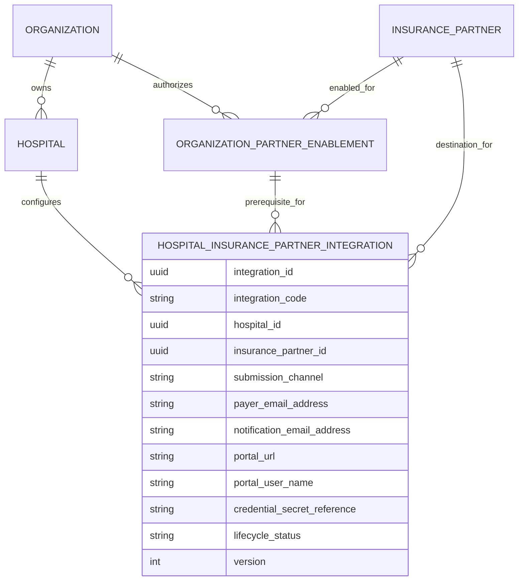

# Insurance Foundation — Hospital–Payer Integration Logical ERD

| Attribute | Value |
|---|---|
| Module | Insurance Foundation |
| Phase | Phase 7 — Insurance Foundation |
| Version | 1.0 |
| Status | Approved — 2026-08-01 |
| Predecessors | Business Understanding, Domain Analysis, and Aggregate Design approved 2026-08-01 |
| Date | 2026-08-01 |

## Objective

Define the logical entities, attributes, relationships, cardinalities, and uniqueness rules required for Hospital-specific Insurer/TPA operational connectivity.

This is a logical model. It does not prescribe PostgreSQL table names, SQL data types, foreign-key names, indexes, or API fields.

## Why

The model must preserve three different concepts:

1. a shared platform Insurer or TPA;
2. Organization authorization to use that partner; and
3. a Hospital-specific operational destination profile.

Keeping these separate prevents cross-Hospital leakage of portal/email configuration and keeps Hospital aggregate ownership intact.

## Logical ERD

The line from `OrganizationPartnerEnablement` to `HospitalInsurancePartnerIntegration` represents a **logical prerequisite**, not a decision to store an enablement foreign key. The physical design will choose the safest enforcement mechanism after the Architecture Review.

## Entity Definitions

### Hospital Insurance Partner Integration

**Logical identifier:** `integration_id`

**Role:** The Hospital-specific operational destination profile for one approved platform Insurer or TPA.

| Logical attribute | Required | Purpose |
|---|---:|---|
| Integration ID | Yes | Stable aggregate identity. |
| Integration Code | Yes | Human-operable Hospital-scoped business identifier. |
| Hospital ID | Yes | References the configured Hospital. |
| Insurance Partner ID | Yes | References the platform Insurer or TPA. |
| Submission Channel | Yes | Controlled channel: Email, RPA Portal, or future API. |
| Payer Email Address | Conditional | Required when the selected channel is Email. |
| Notification Email Address | No | Optional operational notification destination. |
| Portal URL | Conditional | Required when the selected channel is RPA Portal. |
| Portal User Name | Conditional | Required when the selected channel is RPA Portal. |
| Credential Secret Reference | Conditional | Required for secret-bearing channels; contains no secret value. |
| Lifecycle Status | Yes | Draft, active, inactive, or retired behavior using controlled values. |
| Created / Updated / Deleted audit | Yes | Standard ClaimNX audit history. |
| Version | Yes | Optimistic concurrency control. |

### Existing related logical entities

| Entity | Relationship to integration | Ownership remains with |
|---|---|---|
| Hospital | One Hospital configures zero or many integrations. | Hospital bounded context |
| Insurance Partner | One Insurer/TPA may be configured by zero or many Hospitals. | Insurance Foundation |
| Organization Partner Enablement | One enabled Organization–Partner authorization is a prerequisite for zero or many Hospital integrations in that Organization. | Insurance Foundation |
| Organization | Indirect tenant owner of the integration through Hospital. | Organization domain |
| Reference Value | Controls Partner Type, Submission Channel, and Lifecycle Status. | Reference Data |

## Relationship and Cardinality Rules

1. One Hospital may have zero or many Hospital–Payer Integrations.
2. One Hospital–Payer Integration belongs to exactly one Hospital.
3. One Insurance Partner may have zero or many Hospital–Payer Integrations.
4. One Hospital–Payer Integration references exactly one Insurance Partner whose type is `INSURER` or `TPA`.
5. An integration is valid only when the Hospital’s Organization has an active Organization Partner Enablement for the same Insurance Partner.
6. One Organization Partner Enablement may authorize many Hospital integrations across that Organization’s Hospitals.
7. An integration does not own a Partner Contact, Hospital Contact, Organization Member, claim, document, workflow item, or secret.
8. The actual secret remains external to this logical ERD; only its reference is represented.

## Logical Uniqueness Rules

| Rule | Purpose |
|---|---|
| Active `integration_code` unique within a Hospital | Allows staff to identify a route without creating global naming conflicts. |
| One active integration per `(hospital, insurance_partner)` pair | Prevents duplicate active operational destinations in the initial scope. |
| Platform Partner Code unique at platform scope | Existing Insurance Partner master rule; unchanged. |
| Organization Partner Enablement unique per `(organization, insurance_partner)` | Existing authorization rule; unchanged. |

If later business requirements need separate payer routes for pre-authorization, reimbursement, or escalation, a controlled routing-purpose concept will be designed through an approved evolution. It is not silently added now.

## Channel Completeness Rules

| Submission channel | Required logical attributes |
|---|---|
| Email | Payer Email Address |
| RPA Portal | Portal URL, Portal User Name, Credential Secret Reference |
| Future API | Approved connector reference and Credential Secret Reference; no secret value |

All channels prohibit plaintext credentials and transmission payloads.

## Explicit Non-Relationships

- `HospitalInsurancePartnerIntegration` does not contain a claim, pre-authorization, or document reference.
- It does not own or copy Insurance Partner Contacts.
- It does not own Hospital Contact data.
- It does not reference a user-specific browser/RPA session.
- It does not contain a password, API key, token, or encrypted secret payload.
- It does not replace Organization Partner Enablement.

## Validation

- Hospital-specific integration is logically independent from the Hospital aggregate. ✅
- Partner master data remains reusable platform data. ✅
- Organization authorization remains distinct from Hospital operational configuration. ✅
- Logical secret handling contains references only. ✅
- Initial duplicate-active-route prevention is explicit. ✅
- No physical schema, SQL migration, API contract, or code has been created. ✅

## Approval Record

Approved on 2026-08-01. The next deliverable is the Hospital–Payer Integration Architecture Review.
