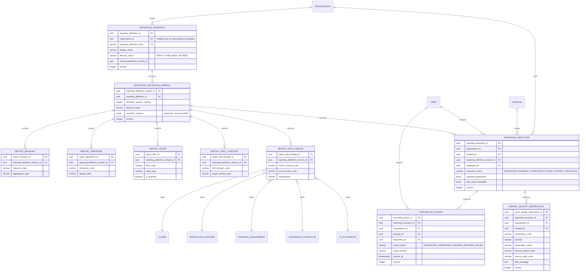

# ClaimNX Phase 11 — Reporting & BI Logical ERD

## 1. Document Information

| Field | Value |
|---|---|
| Module | Reporting & BI |
| Phase | 11 — Reporting & BI |
| Version | 1.0 |
| Status | Draft for Approval |
| Purpose | Logical data model and ownership relationships |
| Architecture | DDD, Clean Architecture, Modular Monolith |

## 2. Objective

Define the governed logical model for tenant-safe reporting definitions, controlled report execution, exports, lineage, and data-quality observations.

This is a **design-only** deliverable. It introduces no physical database change, migration, API, or implementation code.

## 3. Why

Reporting must provide usable operational insight without allowing reports to bypass tenant boundaries, mutate business data, expose credentials, or execute arbitrary SQL.

The model makes report configuration explicit and versioned, while keeping Claims, Financial, Workflow, Insurance, Hospital, IAM, and Automation as the owners of their own operational data.

## 4. Ownership and Scope

Reporting & BI owns:

- Report Definition
- Report Definition Version
- Report Measure
- Report Dimension
- Report Filter
- Report Drill-through
- Report Data Lineage
- Report Execution
- Controlled Export
- Report Quality Observation

Reporting & BI does **not** own or alter:

- Claims and their lifecycle
- Financial posting, settlement, remittance, recovery, or reconciliation
- Workflow state, queues, work items, or assignments
- Insurance partner or Hospital–Payer routing configuration
- Hospital, Organization, member, user, role, or permission records
- Automation work state, model results, external payloads, or secrets

Reporting source data is read-only. Every query is constrained by the requesting tenant context before any aggregation is performed.

## 5. Aggregates

### 5.1 Reporting Definition Aggregate

**Aggregate root:** `ReportingDefinition`

**Child entities:**

- `ReportingDefinitionVersion`
- `ReportMeasure`
- `ReportDimension`
- `ReportFilter`
- `ReportDrillThrough`
- `ReportDataLineage`

The definition is the governed business identity of a report. Its published semantic contract is represented by an immutable version. A version describes approved measures, dimensions, filters, drill-through navigation, and source lineage; it does not contain arbitrary SQL or executable user code.

### 5.2 Reporting Execution Aggregate

**Aggregate root:** `ReportingExecution`

**Child entities:**

- `ControlledExport`
- `ReportQualityObservation`

An execution is a tenant-scoped record of a request to run one exact published report version. It stores only sanitized parameters, safe result metadata, execution status, and audit data. It never stores source credentials, raw external payloads, or unrestricted patient documents.

## 6. Logical ERD

## 7. Entity Responsibilities

| Entity | Responsibility |
|---|---|
| Reporting Definition | Stable, governed identity and lifecycle of a report |
| Reporting Definition Version | Immutable published semantic contract for one report version |
| Report Measure | Approved metric definition; never a free-form expression |
| Report Dimension | Approved grouping or slicing dimension |
| Report Filter | Approved input filter and value contract |
| Report Drill-through | Approved navigation from summary to tenant-safe detail context |
| Report Data Lineage | Declares the permitted read-only source contexts and entities |
| Reporting Execution | Tenant-scoped request and operational record of a report run |
| Controlled Export | Time-bound, auditable export produced from a completed execution |
| Report Quality Observation | Safe, non-mutating observation about data completeness or report quality |

## 8. Cardinality and Lifecycle Rules

1. One Reporting Definition has one or more versions; only one version may be published at a time.
2. One Reporting Definition Version owns zero or more measures, dimensions, filters, drill-through definitions, and lineage records.
3. One Reporting Execution references exactly one published Reporting Definition Version.
4. One Organization owns zero or more Reporting Executions.
5. A Reporting Execution may be Organization-wide or scoped to one Hospital. A Hospital, when supplied, must belong to the same Organization.
6. One Reporting Execution can produce zero or more Controlled Exports and zero or more Report Quality Observations.
7. A Controlled Export can be generated only from a completed, non-expired execution.
8. Report Quality Observations are advisory records. They never update Claims, Financial, Workflow, Insurance, or Automation source data.

## 9. Tenant Isolation and Authorization

- Every execution, export, and quality observation persists `organization_id`.
- Every Hospital-scoped execution, export, and observation persists `hospital_id` and validates the Hospital belongs to the same Organization.
- The API and application service must verify an active Organization Membership before any report read, execution, export, or observation access.
- A user may only access rows where the requested Organization matches the persisted `organization_id`.
- Report data queries must apply the Organization and optional Hospital scope to the source dataset; frontend filtering is never trusted.
- Platform templates, if introduced later, are read-only definitions and do not bypass tenant scope during execution.

## 10. Audit, Privacy, and Security

Every future Reporting & BI business table shall contain:

- `created_by`, `created_at`
- `updated_by`, `updated_at`
- `deleted_by`, `deleted_at`
- `version`

Additional rules:

- UUID identifiers are generated by the application layer.
- Normal operations use soft delete only.
- `version` starts at `1` and is required for mutable commands.
- Published definition versions and completed execution audit facts are immutable.
- No plaintext passwords, tokens, portal credentials, external payloads, or raw document contents may be stored.
- Exports must record safe metadata and a time-bound storage reference only; access authorization is checked again when downloaded.
- Reporting should favor aggregated/de-identified values. Any patient-level drill-through must be explicitly approved and permission-checked.

## 11. Source Context Mapping

| Source Context | Reporting Use | Ownership Boundary |
|---|---|---|
| Claims | Volume, turnaround, lifecycle, query, submission insight | Claim Processing owns source records and lifecycle |
| Financial | Settlement, recovery, posting, reconciliation metrics | Financial Management owns accounting facts |
| Workflow | Queue, ageing, workload, SLA metrics | Workflow Platform owns work state |
| Insurance | Partner, product plan, enablement and routing insight | Insurance Foundation owns partner data |
| Hospital | Tenant and hospital operational dimensions | Hospital context owns hospital aggregate |
| IAM | Permission and actor context only | IAM owns users, roles and permissions |
| AI & Automation | Work request, review and dispatch operational metrics | Automation owns automation state and audit |

## 12. Explicitly Out of Scope

- A data warehouse, lakehouse, ETL/ELT platform, or materialized reporting store
- Scheduled email distribution and subscriptions
- Direct ad-hoc SQL execution by users
- Predictive forecasting or ML model training
- Raw clinical-document analytics
- Cross-Organization benchmarking or data sharing
- Frontend dashboard implementation

## 13. Future Compatibility

The model supports later addition of:

- organization-approved dashboard layouts and widgets;
- scheduled report delivery using a separately approved notification aggregate;
- governed materialized snapshots and refresh jobs;
- semantic metrics catalogues shared across reports;
- de-identified cross-tenant analytics only after explicit legal, security, and business approval.

These enhancements must remain additive and must not weaken report version governance, source ownership, tenant isolation, or export controls.

## 14. Architecture Validation Checklist

- [x] Reporting aggregate ownership is explicit.
- [x] Operational source contexts remain read-only and retain ownership.
- [x] Report definition versions are governed and non-executable.
- [x] Execution, export, and quality observations have persisted tenant scope.
- [x] Hospital scope is optional but tenant-consistent when present.
- [x] Audit, soft-delete, UUID, and optimistic concurrency standards are preserved.
- [x] Sensitive data and credential storage are prohibited.
- [x] The design enables reporting without coupling source-domain writes to BI.

## 15. Approval Gate

**Objective:** Approve the logical Reporting & BI relationships before any architecture review, physical table design, SQL migration, or code is created.

**Validation:** Confirm that governed reporting definitions, executions, exports, and quality observations are correctly separated from source-domain ownership.

**Pause for Approval:** `Approve Reporting & BI Logical ERD`

**Next step after approval:** Reporting & BI Architecture Review.
