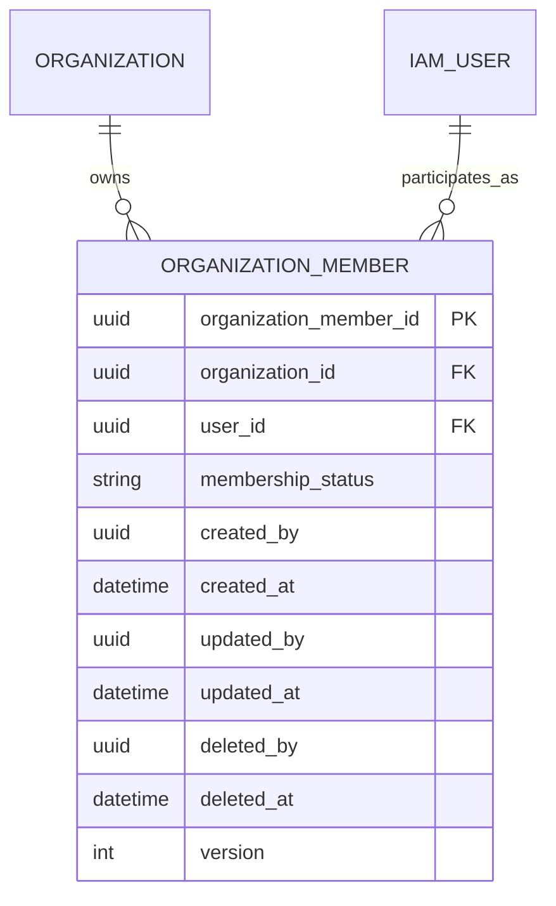

# Organization Member Management — Logical ERD

| Field | Value |
|---|---|
| Module | Tenant Management |
| Capability | Organization Member Management |
| Phase | Phase 5 — Tenant Management |
| Status | Approved — 2026-07-30 |
| Owner | Solution Architecture |
| Date | 2026-07-30 |
| Prerequisites | Business Understanding, Domain Analysis, and Aggregate Design approved 2026-07-30 |

## Objective

Define logical relationships and cardinalities for the Organization Member aggregate before physical table, column, foreign-key, index, or migration design.

## Logical ERD



## Logical Entities

### Organization Member

| Logical attribute | Required | Meaning |
|---|---|---|
| Organization Member Identifier | Yes | Stable UUID identity of the aggregate. |
| Organization Reference | Yes | Single tenant that owns the membership; immutable after creation. |
| IAM User Reference | Yes | Existing IAM User participating in the Organization; immutable after creation. |
| Membership Status | Yes | Operational status: `ACTIVE` or `SUSPENDED`. |
| Creation Audit | Yes | Actor and timestamp that created the relationship. |
| Update Audit | Yes | Actor and timestamp of the latest successful mutation. |
| Deletion Audit | No until retirement | Actor and timestamp when the membership is soft-retired. |
| Version | Yes | Optimistic-concurrency value; begins at 1. |

### External References

**Organization** is the tenant-owner entity. Organization Member Management references it but never owns, updates, or deletes it.

**IAM User** is the external identity entity. This capability references it but does not own credentials, profile data, authentication, or the User lifecycle.

IAM owns role and permission assignment for each User. The approved Organization Type Role foundation governs role eligibility by Organization type. Organization Member Management must never create a second independent role or permission catalogue, nor add a direct role reference to membership.

## Cardinality and Relationship Rules

| Relationship | Cardinality | Business rule |
|---|---|---|
| Organization → Organization Member | One-to-many | One Organization may own many memberships; each membership belongs to exactly one Organization. |
| IAM User → Organization Member | One-to-many | One IAM User may hold memberships in many Organizations; each membership references exactly one User. |
| Organization Member → Organization | Many-to-one | Membership cannot be reassigned to another Organization. |
| Organization Member → IAM User | Many-to-one | Membership cannot be reassigned to another IAM User. |

## Logical Uniqueness

The following business identifier is unique only among active, non-retired memberships:

```text
(organization_id, user_id)
```

This supports one User in multiple Organizations while preventing duplicate active membership within the same Organization. A retired membership is historical and does not block a newly authorized membership.

## Lifecycle Representation

| Business state | Logical representation | Authorizes tenant access? |
|---|---|---|
| Active | `membership_status = ACTIVE`; no soft-delete audit values. | Yes, subject to permission check. |
| Suspended | `membership_status = SUSPENDED`; no soft-delete audit values. | No. |
| Retired | Soft-delete audit values are populated. | No. |

`RETIRED` is the logical outcome of soft deletion, not an independently mutable operational status.

## Audit and Concurrency Model

Every Organization Member record requires the ClaimNX audit model:

```text
created_by, created_at
updated_by, updated_at
deleted_by, deleted_at
version
```

Audit actors are IAM User references. Exact physical foreign-key constraints are deferred to Physical Database Design.

## Tenant-Isolation Relationship Rule

The membership `organization_id` is the tenant boundary. An Organization-scoped request must match the requested Organization to an active, non-deleted Organization Member for the authenticated User. A route parameter, request body, JWT tenant claim, or frontend switcher alone is never sufficient.

## Explicitly Excluded Logical Entities

- Member Profile;
- Member Invitation;
- Member Hospital Assignment;
- Member Department Assignment;
- Member Permission Override;
- User Credential;
- Role Definition;
- Permission Definition; and
- Workflow Assignment.

These exclusions protect the aggregate boundary and prevent duplicate ownership with IAM, Hospital, and Workflow contexts.

## Open Verification Items for Architecture Review

1. Verify live constraints and dependent records for the existing Organization Member foundation.
2. Confirm the tenant-administrator role/permission if final-administrator protection is required in a future capability.
3. Confirm whether an explicit, audited platform Super Admin exception applies to Organization Member administration.

## Validation

- Organization Member is the only aggregate entity.
- Organization and IAM User retain external ownership boundaries; IAM retains role and permission ownership.
- Cross-Organization User membership is supported without duplicate active membership within one Organization.
- Audit, soft delete, and optimistic concurrency are represented.
- No physical table name, SQL migration, NestJS entity, repository, API, or test implementation has been created.

## Approval Record

Approved on 2026-07-30. The next step is **Organization Member Management —
Architecture Review**.
