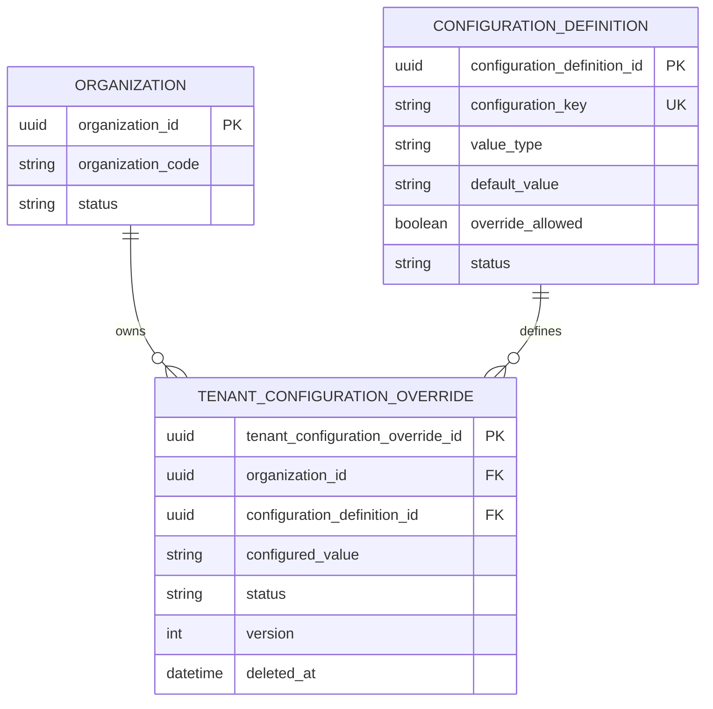

# Tenant Configuration — Logical ERD and Data Model

| Field | Value |
|---|---|
| Module | Tenant Management |
| Capability | Tenant Configuration |
| Phase | Phase 5 |
| Status | Draft — approval required before architecture review |
| Prerequisite | Bounded Context and Aggregate Design approved |
| Date | 2026-07-30 |

## Objective

Define the logical data model and relationships for platform configuration
definitions, Organization overrides, and effective configuration resolution.

## Logical Entities

### Organization

Existing tenant owner. This entity is not redesigned by this capability.

| Attribute | Meaning |
|---|---|
| Organization ID | Immutable tenant identifier |
| Organization Status | Determines whether configuration may be administered |

### Configuration Definition

Platform-governed catalogue entry that defines a controlled configuration key.

| Attribute | Meaning |
|---|---|
| Configuration Definition ID | Immutable platform identifier |
| Configuration Key | Stable, globally unique machine-readable key |
| Display Name | Administrator-facing name |
| Category | Functional grouping for discovery and governance |
| Value Type | `BOOLEAN`, `INTEGER`, `STRING`, `ENUM`, or `JSON` |
| Default Value | Platform fallback when no active override exists |
| Validation Rule | Type, range, pattern, or allowed-value rule |
| Override Allowed | Whether Organizations may define an override |
| Status | Active/inactive lifecycle state |

### Tenant Configuration Override

Organization-owned override of one Configuration Definition.

| Attribute | Meaning |
|---|---|
| Tenant Configuration Override ID | Immutable business identifier |
| Organization ID | Immutable tenant owner |
| Configuration Definition ID | Immutable catalogue reference |
| Configured Value | Override value validated against definition |
| Status | `ACTIVE` or `INACTIVE` |
| Version | Optimistic concurrency version |
| Audit and soft-delete fields | Enterprise audit standard |

## Logical Relationships

```text
Organization (1) ────────< (0..*) Tenant Configuration Override (0..*) >──────── (1) Configuration Definition
```

Interpretation:

- One Organization may have zero or many overrides.
- One Configuration Definition may be overridden by zero or many
  Organizations.
- One override references exactly one Organization and one Definition.
- An Organization has at most one active, non-deleted override for a given
  Definition.

## Logical ERD



## Effective Value Resolution Model

| Override state | Definition default state | Effective value |
|---|---|---|
| Active, non-deleted | Active | Override value |
| Inactive | Active | Platform default |
| Soft-deleted | Active | Platform default |
| No override | Active | Platform default |
| Any | Inactive | Not available for normal use |

The effective value is resolved at read time. It is not copied into Hospital or
other consumer records.

## Logical Uniqueness Rules

1. Configuration Definition `configuration_key` is globally unique.
2. A Tenant Configuration Override is unique by `(organization_id,
   configuration_definition_id)` among active, non-deleted overrides.
3. The override ID is immutable and globally unique.
4. Configuration keys are case-normalized before comparison; exact physical
   representation will be decided during PostgreSQL design.

## Logical Validation Rules

1. The Definition must be active and allow overrides.
2. The Organization must be active and belong to the requesting actor's tenant
   membership scope.
3. A configured value must conform to the Definition value type and rule.
4. `BOOLEAN`, `INTEGER`, and `ENUM` values have canonical textual or JSON
   representation defined by the catalogue.
5. `JSON` is reserved for a future approved schema-validation enhancement.
6. Secrets, passwords, and credentials are rejected as configuration values.

## Legacy Foundation Alignment

`public.organization_configurations` remains an existing legacy foundation.
It resembles a tenant override but does not yet represent the approved logical
model because it has no governed Definition relationship, value type, default,
or override policy. A later physical database design will specify a safe,
forward-only evolution or coexistence strategy. No current table is dropped or
renamed at this stage.

## Validation

- The model enforces one Organization owner per override.
- The catalogue and tenant override remain separate ownership concepts.
- Effective resolution does not duplicate configuration across consuming
  bounded contexts.
- No physical SQL, migration, API, or implementation has been created.

## Pause for Approval

Approve or amend this logical ERD and data model. The next step is Tenant
Configuration Architecture Review and API Design Principles.
