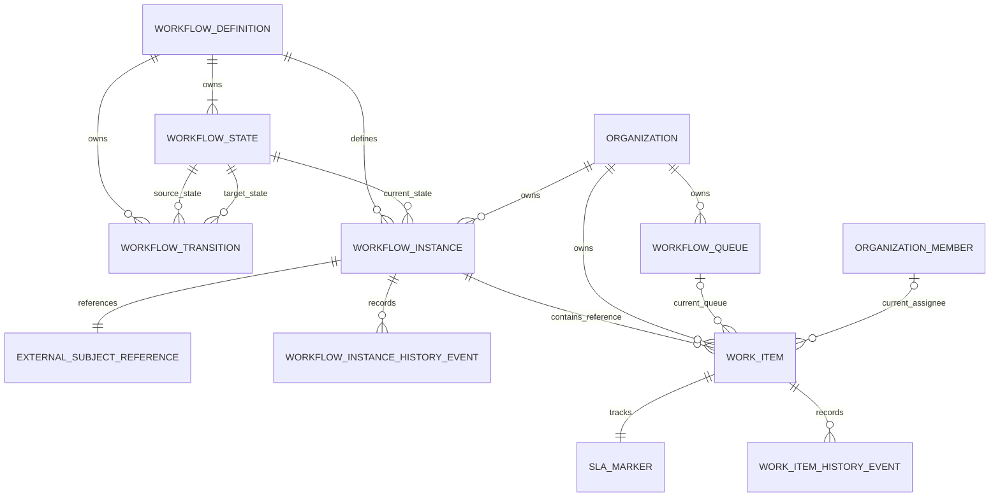

# ClaimNX Workflow Platform — Logical ERD

| Field | Value |
|---|---|
| Module | Workflow Platform |
| Phase | Phase 6 — Workflow Platform |
| Version | 1.0 |
| Status | Approved — 2026-07-30 |
| Prerequisites | Business Understanding, Domain Analysis, and Aggregate Design approved 2026-07-30 |
| Date | 2026-07-30 |

## Objective

Translate the approved Workflow Platform aggregates into a logical Entity
Relationship Diagram. This is a business/logical model only: it does not define
PostgreSQL table names, data types, indexes, foreign keys, SQL, or migration
strategy.

## Logical entities

| Entity | Aggregate ownership | Purpose |
|---|---|---|
| Workflow Definition | Workflow Definition | Platform-governed process template. |
| Workflow State | Workflow Definition child | Approved state in one Definition. |
| Workflow Transition | Workflow Definition child | Permitted directed state change within one Definition. |
| Workflow Instance | Workflow Instance | Organization-scoped execution for one External Subject. |
| Workflow Instance History Event | Workflow Instance child | Append-only record of Instance-level action. |
| Workflow Queue | Workflow Queue | Organization-scoped operational work pool. |
| Work Item | Work Item | Independently executable operational work within an Instance. |
| Work Item History Event | Work Item child | Append-only record of Work Item action. |
| Current Assignment | Work Item value object/reference | Current Queue and/or direct Organization Member responsibility. |
| SLA Marker | Work Item value object | Current due, breach, pause, and timing context. |
| External Subject Reference | Workflow Instance value object/reference | Context/type and identifier for a record owned elsewhere. |

## Logical relationship diagram

`ORGANIZATION` and `ORGANIZATION_MEMBER` are external references owned by
Tenant Management. `EXTERNAL_SUBJECT_REFERENCE` points to a future business
entity owned by its originating bounded context; it is not a direct logical
relationship to a Claim, Policy, or Patient in Phase 6.

## Entity responsibilities and logical attributes

### Workflow Definition

Logical identity and purpose:

- Definition Identifier
- Stable Definition Code
- Display Name and Description
- Definition Lifecycle
- Definition Version
- Definition-level policy metadata

Relationship rules:

- owns one or more Workflow States;
- owns zero or more Workflow Transitions;
- is referenced by zero or more Workflow Instances;
- may not be retired while an unapproved Definition change would invalidate
  historical Instance meaning.

### Workflow State

Logical identity and purpose:

- State Identifier
- Parent Definition Identifier
- State Code and Display Name
- Initial/Terminal indicators
- State ordering/presentation metadata

Relationship rules:

- belongs to exactly one Workflow Definition;
- may be the source and/or target of many Transitions;
- may be the current state of many historical/current Instances;
- cannot exist independently of its Definition.

### Workflow Transition

Logical identity and purpose:

- Transition Identifier
- Parent Definition Identifier
- Source State Reference
- Target State Reference
- Transition Code/Name
- Optional policy metadata

Relationship rules:

- belongs to exactly one Definition;
- connects exactly one source State to exactly one target State;
- source and target States must belong to the same Definition;
- has no independent lifecycle outside its Definition.

### Workflow Instance

Logical identity and purpose:

- Instance Identifier
- Organization Reference
- Definition Reference and Definition Version Snapshot
- Current State Reference
- External Subject Reference
- Instance Lifecycle
- Version and standard audit context

Relationship rules:

- belongs to exactly one Organization;
- uses exactly one Definition reference;
- has exactly one current State compatible with that Definition;
- has exactly one External Subject Reference;
- records zero or more Instance History Events;
- is referenced by zero or more Work Items;
- does not own Work Items as transactional child entities.

### External Subject Reference

Logical purpose:

- Subject Context / Bounded Context Name
- Subject Type
- Subject Identifier
- Optional subject display reference for operations

Relationship rules:

- belongs to exactly one Workflow Instance;
- refers to exactly one subject in another bounded context;
- does not grant Workflow ownership over that subject;
- remains immutable after Instance start.

### Workflow Queue

Logical identity and purpose:

- Queue Identifier
- Organization Reference
- Queue Code and Display Name
- Queue Lifecycle
- Optional routing/operational metadata
- Version and standard audit context

Relationship rules:

- belongs to exactly one Organization;
- may be the current Queue for zero or many Work Items;
- does not own those Work Items;
- can only receive a new Work Item assignment while active.

### Work Item

Logical identity and purpose:

- Work Item Identifier
- Organization Reference
- Workflow Instance Reference
- Work Item lifecycle/state reference
- Current Queue Reference (optional)
- Current Organization Member Assignee Reference (optional)
- Priority
- SLA Marker
- Version and standard audit context

Relationship rules:

- belongs to exactly one Workflow Instance;
- belongs to exactly one Organization, equal to the parent Instance
  Organization;
- may reference zero or one current Queue in that Organization;
- may reference zero or one current direct Organization Member assignee in that
  Organization;
- owns zero or more Work Item History Events;
- has exactly one current SLA Marker value object.

### Workflow Instance History Event and Work Item History Event

Logical identity and purpose:

- History Event Identifier
- Owning root reference
- Event Type
- Previous and resulting operational context
- Actor reference
- Occurred-at timestamp
- Optional reason/comment

Relationship rules:

- belongs to exactly one owning aggregate root;
- is created with the operation it explains;
- is append-only; it has no normal update/delete workflow;
- inherits Organization context through its owning root.

## Cardinality rules

| Relationship | Cardinality | Rule |
|---|---|---|
| Definition → State | 1 to many | An active Definition has at least one State. |
| Definition → Transition | 0 to many | Transitions are optional while drafting. |
| State → Transition | 0 to many as source and target | Both endpoints must be from the same Definition. |
| Definition → Instance | 1 to many | Each Instance references one Definition/version. |
| Organization → Instance | 1 to many | Instance belongs to one tenant. |
| Instance → Work Item | 1 to many reference | Work Item is a separate aggregate. |
| Organization → Queue | 1 to many | Queue belongs to one tenant. |
| Queue → Work Item | 0 to many reference | Queue does not own Work Items. |
| Organization Member → Work Item | 0 to many reference | One current direct assignee per Work Item. |
| Root → History Event | 1 to many | Events are append-only owned children. |

## Tenant isolation model

| Logical entity | Tenant scope | How isolation is represented |
|---|---|---|
| Workflow Definition / State / Transition | Platform | No Organization ownership; platform governance only. |
| Workflow Instance | Organization | Direct Organization reference. |
| Workflow Queue | Organization | Direct Organization reference. |
| Work Item | Organization | Direct Organization reference plus same-tenant Instance reference. |
| History Event | Inherited | Owner root establishes tenant context. |
| Assignment | Inherited / validated | Work Item Organization must equal Organization Member Organization. |

## Logical uniqueness rules

These are business rules only; physical unique constraints and soft-delete
behaviour will be designed later.

- Workflow Definition Code is unique in platform scope.
- Workflow State Code is unique within its Definition.
- Workflow Transition Code is unique within its Definition.
- Active Queue Code is unique within its Organization.
- A Work Item has at most one current direct assignee.
- An Instance has one External Subject Reference; the later business decision
  will determine whether the same Definition may start more than one active
  Instance for the same subject.

## Deliberate exclusions from this ERD

- No Claim, Patient, Policy, Settlement, Hospital, User, Role, Permission, or
  Organization Member attributes are modeled here.
- No queues-to-members membership matrix is introduced.
- No schema is inferred from legacy `workflow_instances` or `workflow_queues`.
  Their compatibility assessment happens during Physical Database Design.
- No table, field type, key, index, or SQL name is approved by this document.

## Validation

- Logical relationships preserve the approved aggregate boundaries.
- Work Item remains independently concurrency-controlled.
- No external bounded context loses ownership of its data.
- Tenant scope is explicit for every Organization-owned logical entity.
- No physical database or implementation decision has been made.

## Approval record

Approved on 2026-07-30. The logical entities, ownership boundaries,
cardinalities, tenant-isolation model, and deliberate exclusions are accepted.

Next mandatory stage: **Workflow Platform Architecture Review**.
